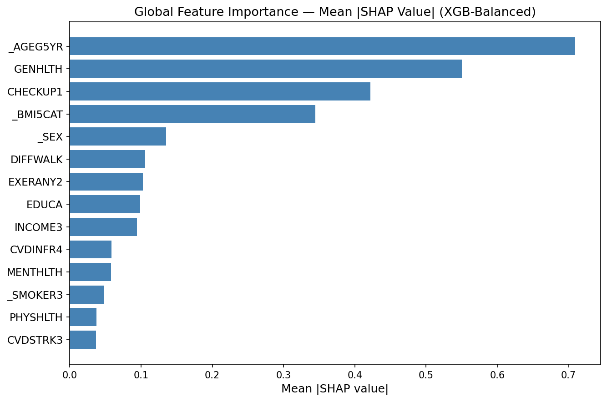
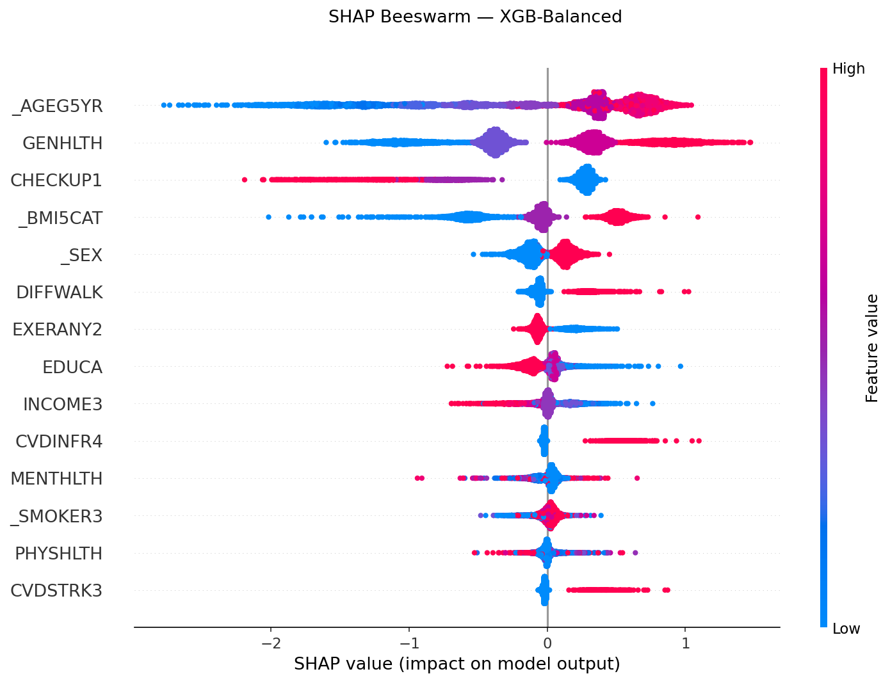
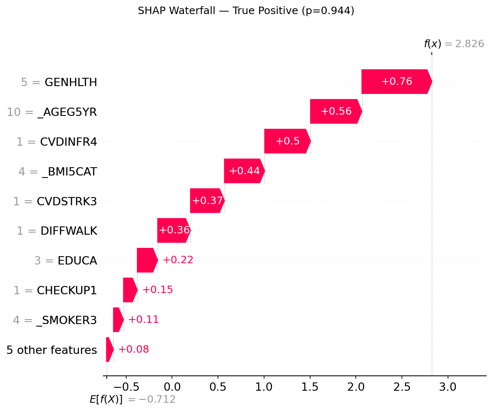
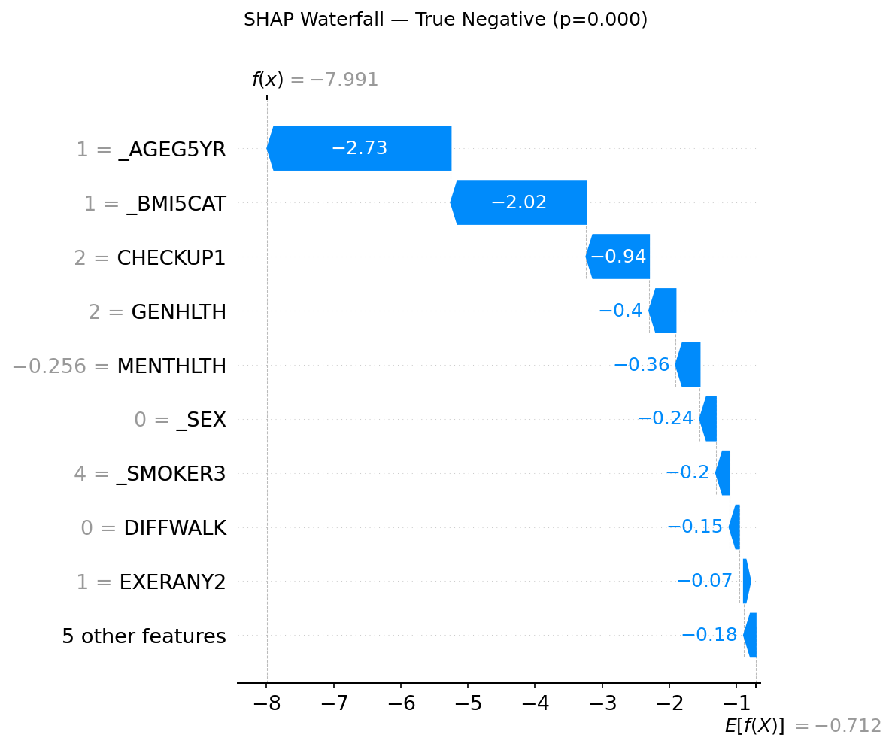

# Predicting Diabetes Risk Using Machine Learning

An end-to-end machine learning pipeline for predicting diabetes risk from
large-scale, nationally representative behavioural survey data.

**Data**: CDC BRFSS 2022–2024 &nbsp;|&nbsp;
**Samples**: 1,252,580 &nbsp;|&nbsp;
**Best model**: XGBoost ROC-AUC **0.815** &nbsp;|&nbsp;
**Sensitivity**: **0.797**

---

## Table of Contents

1. [Project Overview](#1-project-overview)
2. [Why BRFSS?](#2-why-brfss)
3. [Pipeline](#3-pipeline)
4. [Results](#4-results)
5. [SHAP Interpretation](#5-shap-interpretation)
6. [Feature Set](#6-feature-set)
7. [Key Findings](#7-key-findings)
8. [Limitations](#8-limitations)
9. [Reproducibility](#9-reproducibility)
10. [Tech Stack](#10-tech-stack)
11. [Docs](#11-docs)

---

## 1. Project Overview

Diabetes affects hundreds of millions of people worldwide. Early identification of
high-risk individuals is critical for timely intervention. This project builds and
compares six machine learning models — Logistic Regression, Random Forest, and XGBoost,
each under two class-imbalance strategies — using survey-based behavioural and demographic
features to predict diabetes diagnosis.

**Goals:**
- Demonstrate a production-quality ML pipeline on a real, messy, large-scale dataset
- Compare model families and imbalance strategies systematically
- Provide interpretable, clinically grounded explanations via SHAP values
- Document every decision with rationale (see [`ProjectDriven.md`](ProjectDriven.md))

---

## 2. Why BRFSS?

Most public diabetes ML projects use the Pima Indians dataset (UCI, 768 rows, 1990s data).
This project deliberately uses a harder, richer alternative:

| | Pima Indians (UCI) | CDC BRFSS (this project) |
|---|---|---|
| Sample size | 768 | **1,252,580** |
| Demographics | Pima Indian women only | Nationally representative US adults |
| Features | 7 clinical biomarkers | **14** behavioural + demographic |
| Recency | 1990s | **2022–2024** |
| Data quality | Pre-cleaned | Special codes, structural absences, multi-year alignment |
| Generalisability | Very low | High |

Using BRFSS introduces real data engineering challenges: fixed-width ASCII parsing,
HTML codebook parsing, BRFSS-specific special codes, multi-year variable alignment,
and structural missingness that varies by survey year.

---

## 3. Pipeline

```
CDC BRFSS ASCII files + HTML codebooks (2022, 2023, 2024)
│
├── 00_data_collection.ipynb
│       Automated codebook parser → fixed-width extraction → 1,336,125 × 23 rows
│
├── 01_data_understanding.ipynb
│       EDA: distributions, correlations, missing profiles, special code audit → 11 figures
│
├── 02_cleaning.ipynb
│       Recode specials, drop 6 vars, impute 8 vars → brfss_cleaned.csv (1,252,580 × 17)
│
├── 03_feature_engineering.ipynb
│       VIF analysis, binary recoding, scaling, 80/20 split, SMOTE → 14 features, 6 data files
│
├── 04_modeling.ipynb
│       6 model variants (LR / RF / XGB × Balanced / SMOTE) → XGB-Balanced ROC-AUC 0.8148
│
└── 05_evaluation.ipynb
        SHAP global + individual explanations → 5 figures + methodology.md + findings.md
```

All notebooks run in sequence (00 → 05). Every cleaning and modelling decision is
logged with rationale in [`ProjectDriven.md`](ProjectDriven.md).

---

## 4. Results

Six model variants were trained and evaluated on the same held-out test set
(250,516 respondents, 14.4% positive — never resampled).
Primary metric: **ROC-AUC** (robust to class imbalance).

| Model | Accuracy | Precision | Recall | F1 | ROC-AUC |
|-------|:--------:|:---------:|:------:|:--:|:-------:|
| **XGB-Balanced** ⭐ | 0.699 | 0.625 | **0.740** | 0.614 | **0.815** |
| LR-Balanced | 0.717 | 0.625 | 0.731 | 0.623 | 0.804 |
| LR-SMOTE | 0.705 | 0.621 | 0.727 | 0.614 | 0.799 |
| XGB-SMOTE | 0.754 | 0.620 | 0.695 | 0.631 | 0.787 |
| RF-SMOTE | 0.758 | 0.601 | 0.650 | 0.611 | 0.737 |
| RF-Balanced | 0.779 | 0.594 | 0.617 | 0.602 | 0.726 |

### Best Model: XGB-Balanced — Confusion Matrix (test set, n=250,516)

|  | Predicted: No Diabetes | Predicted: Diabetes |
|--|:----------------------:|:-------------------:|
| **Actual: No Diabetes** | 146,159 (TN) | 68,196 (FP) |
| **Actual: Diabetes** | 7,337 (FN) | 28,824 (TP) |

- **Sensitivity** (True Positive Rate): **0.797** — 4 in 5 diabetic respondents correctly identified
- **Specificity** (True Negative Rate): 0.682

### Imbalance Strategy: Balanced vs SMOTE

`scale_pos_weight` (loss-function reweighting) outperformed SMOTE across all three
algorithm families on ROC-AUC. Synthetic oversampling marginally improved Recall
but hurt discrimination — suggesting synthetic minority samples do not generalise
as well as reweighting the loss on real data at 1.25M scale.

---

## 5. SHAP Interpretation

[SHAP (SHapley Additive exPlanations)](https://shap.readthedocs.io/) was used to
explain the XGB-Balanced model. `shap.TreeExplainer` computes exact Shapley values
by exploiting XGBoost's tree structure — no approximations required.

**Global importance** (mean |SHAP| across 5,000 test samples):



**Direction and spread** (beeswarm — each dot is one respondent, colour = feature value):



**Individual explanations** — how the model arrived at two specific predictions:

| True Positive (p = 0.944) | True Negative (p = 0.0003) |
|:---:|:---:|
|  |  |

The True Positive profile: GENHLTH=5 (poor), age group 10 (older adult), heart attack
history, obese BMI, stroke history — every major risk factor stacked.
The True Negative profile: age group 1 (youngest), underweight BMI, good health,
recent checkup — the model pushes strongly negative with high confidence.

---

## 6. Feature Set

14 features retained after Phase 3 feature engineering:

| Variable | Type | Description | SHAP Rank |
|----------|------|-------------|:---------:|
| `_AGEG5YR` | Ordinal (1–14) | Age group in 5-year intervals | **#1** |
| `GENHLTH` | Ordinal (1–5) | Self-rated general health (1=Excellent, 5=Poor) | **#2** |
| `CHECKUP1` | Ordinal (1–4) | Time since last routine checkup | **#3** |
| `_BMI5CAT` | Ordinal (1–4) | BMI category (1=Underweight, 4=Obese) | **#4** |
| `_SEX` | Binary (0/1) | Sex (1=Male, 0=Female) | #5 |
| `DIFFWALK` | Binary (0/1) | Difficulty walking or climbing stairs | #6 |
| `EXERANY2` | Binary (0/1) | Physical activity in past 30 days | #7 |
| `EDUCA` | Ordinal (1–6) | Highest education level | #8 |
| `INCOME3` | Ordinal (1–11) | Annual household income bracket | #9 |
| `CVDINFR4` | Binary (0/1) | Heart attack history | #10 |
| `MENTHLTH` | Continuous (scaled) | Days mental health not good (0–30) | #11 |
| `_SMOKER3` | Ordinal (1–4) | Smoking status (1=Current daily, 4=Never) | #12 |
| `PHYSHLTH` | Continuous (scaled) | Days physical health not good (0–30) | #13 |
| `CVDSTRK3` | Binary (0/1) | Stroke history | #14 |

**Variables dropped** (with rationale):

| Variable | Phase | Reason |
|----------|-------|--------|
| `BPHIGH6`, `_CHOLCH3` | Phase 2 | Present in 2023 only — 67.6% structurally missing |
| `PREDIAB2` | Phase 2 | 65.2% missing + direct target leakage |
| `SEXVAR` | Phase 2 | Exact duplicate of `_SEX` (r=1.00) |
| `_STATE` | Phase 2 | 50-level FIPS code — no ordinal meaning |
| `_RACE` | Phase 2 | Structurally absent in 2022; imputing demographic identity is unsafe |
| `POORHLTH` | Phase 3 | Multicollinearity with `PHYSHLTH` (r=0.70); lower Phase 1 rank |
| `YEAR` | Phase 3 | Temporal leakage risk; prevalence shift <1pp across years |

---

## 7. Key Findings

**1. Age is the dominant predictor.**
`_AGEG5YR` has the highest mean |SHAP| value (0.709) — more than 25% higher than the
second-ranked feature. Older age groups push predictions strongly toward the positive class.

**2. Self-rated health is a powerful proxy.**
`GENHLTH` ranks second (mean |SHAP| = 0.550). Poor self-rated health captures a broad
burden of undiagnosed or poorly managed chronic conditions, including undetected diabetes.

**3. `CHECKUP1` shows a counterintuitive negative association.**
Longer time since last routine checkup is associated with *lower* predicted diabetes risk.
This is not a causal finding — it likely reflects survivorship bias (healthier individuals
see doctors less) or healthcare access confounding (uninsured individuals are both less
likely to attend checkups and less likely to have a diabetes diagnosis on record).

**4. Loss-function reweighting outperforms SMOTE at scale.**
Across all three algorithm families, `scale_pos_weight` / `class_weight='balanced'`
produced higher ROC-AUC than SMOTE. At 1.25M rows, synthetic minority samples do not
add generalisable signal beyond what reweighting achieves on real data.

**5. Built-in gain importance inflates `CVDINFR4`.**
XGBoost ranks `CVDINFR4` (heart attack history) 5th by gain, but SHAP ranks it 10th.
Gain-based importance reflects how often a feature is used for splits, not how much
it moves individual predictions. SHAP provides a more honest view of prediction impact.

---

## 8. Limitations

1. **No clinical biomarkers** — No blood glucose, HbA1c, or insulin data.
   The model uses behavioural and demographic proxies only. Clinical sensitivity
   is lower than a biomarker-based tool.

2. **Self-report bias** — All features come from telephone survey responses.
   Underreporting of unhealthy behaviours and undiagnosed diabetes (coded 0) are
   unmeasurable sources of noise.

3. **No racial/ethnic fairness analysis** — `_RACE` was dropped because it is
   structurally absent in 2022 BRFSS data. Model performance across racial and
   ethnic subgroups cannot be assessed.

4. **US adult population only** — BRFSS surveys US adults exclusively.
   Generalisation to other countries or healthcare systems is not supported.

5. **Temporal scope** — Data covers 2022–2024 only. Pre-pandemic patterns
   and future trends are not captured.

---

## 9. Reproducibility

All notebooks run in sequence (00 → 05). Random seeds are fixed (`random_state=42`).

**Environment setup:**

```bash
conda create -n diabetes-ml python=3.11
conda activate diabetes-ml
pip install -r requirements.txt
```

**Data setup:**

1. Download BRFSS ASCII files and HTML codebooks for 2022, 2023, 2024 from
   https://www.cdc.gov/brfss/annual_data/annual_data.htm
2. Place all files in `data/source/`
3. Run notebooks `00` → `05` in sequence

> **Note on model files:** Trained models in `models/saved_models/` are excluded
> from Git. Random Forest files are 2–3 GB; XGBoost files are ~450 KB.
> All models are fully reproducible by running `04_modeling.ipynb`.
> `models/scaler.pkl` (< 1 KB) is tracked and included.

---

## 10. Tech Stack

| Library | Version | Purpose |
|---------|---------|---------|
| Python | 3.11 | Core language |
| pandas | ≥ 2.0 | Data loading and manipulation |
| numpy | ≥ 1.26 | Numerical operations |
| matplotlib | ≥ 3.7 | Plotting |
| seaborn | ≥ 0.12 | Statistical visualisation |
| scikit-learn | 1.4.2 | Models, preprocessing, metrics |
| imbalanced-learn | 0.14.1 | SMOTE oversampling |
| statsmodels | ≥ 0.14 | VIF calculation |
| scipy | ≥ 1.11 | Chi-square test |
| xgboost | ≥ 2.0 | Gradient boosting |
| shap | ≥ 0.44 | Model interpretability |
| joblib | ≥ 1.3 | Model serialisation |

---

## 11. Docs

| Document | Description |
|----------|-------------|
| [`ProjectDriven.md`](ProjectDriven.md) | Living project log — all phase decisions and rationale |
| [`docs/methodology.md`](docs/methodology.md) | Full methodology — data, cleaning, modelling, evaluation |
| [`docs/findings.md`](docs/findings.md) | Key findings — results, SHAP insights, limitations |
| [`docs/p2_ProjectScope.md`](docs/p2_ProjectScope.md) | Original project specification |

---

## License

This project is for educational and portfolio purposes only.
CDC BRFSS data is publicly available under open data policy.
